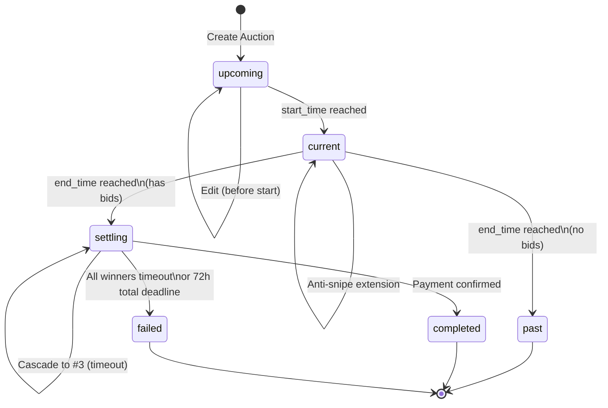
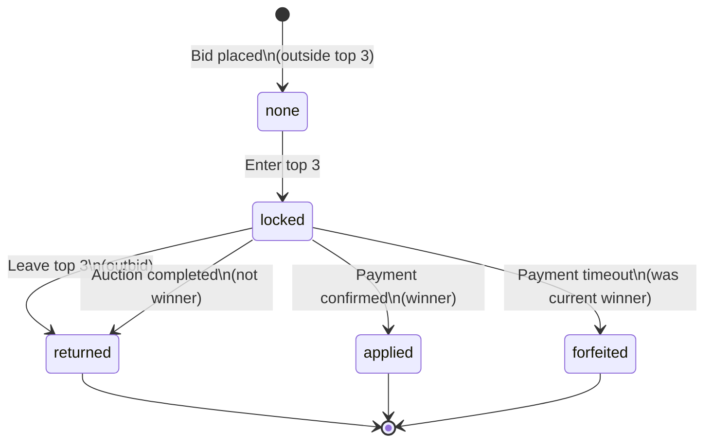
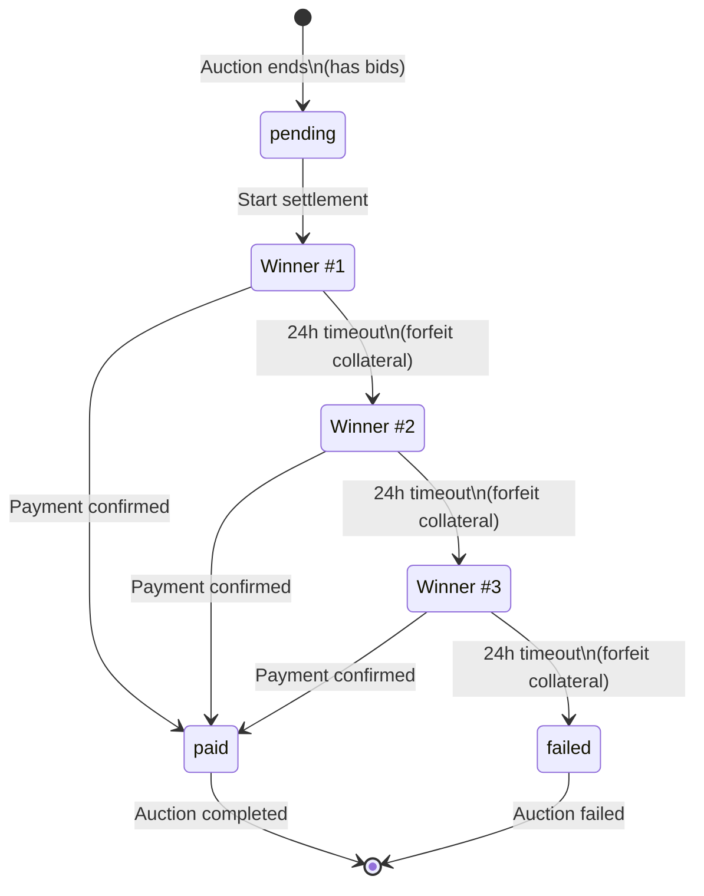
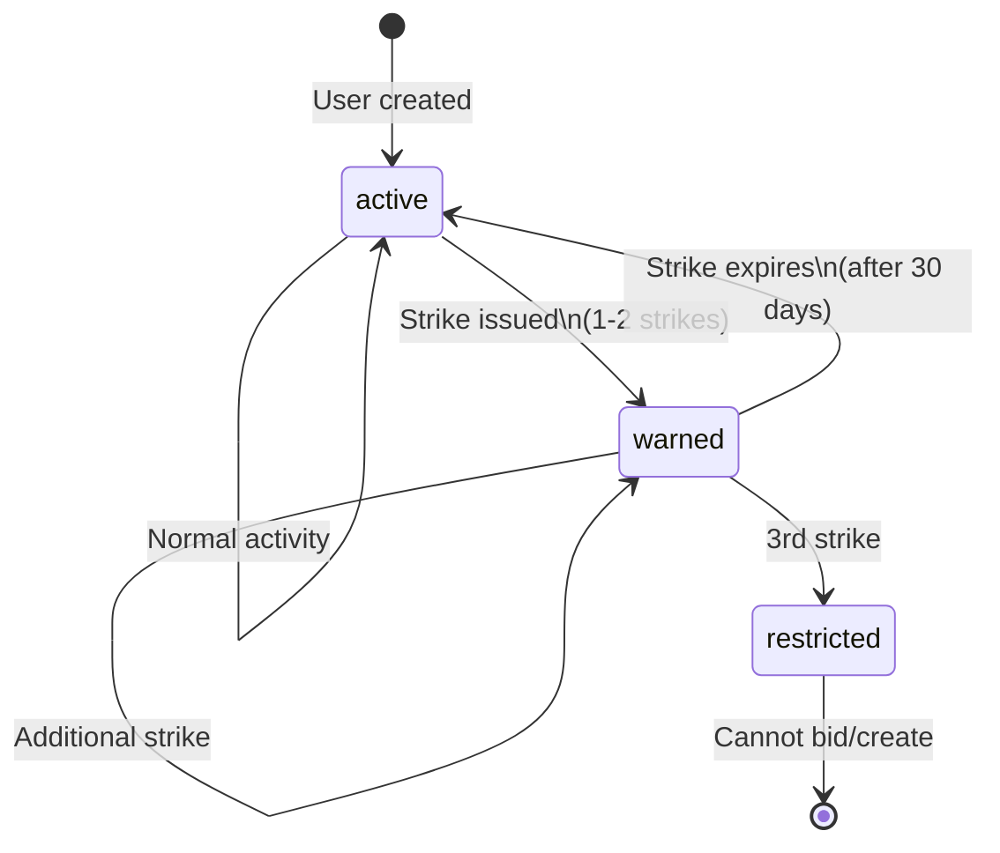
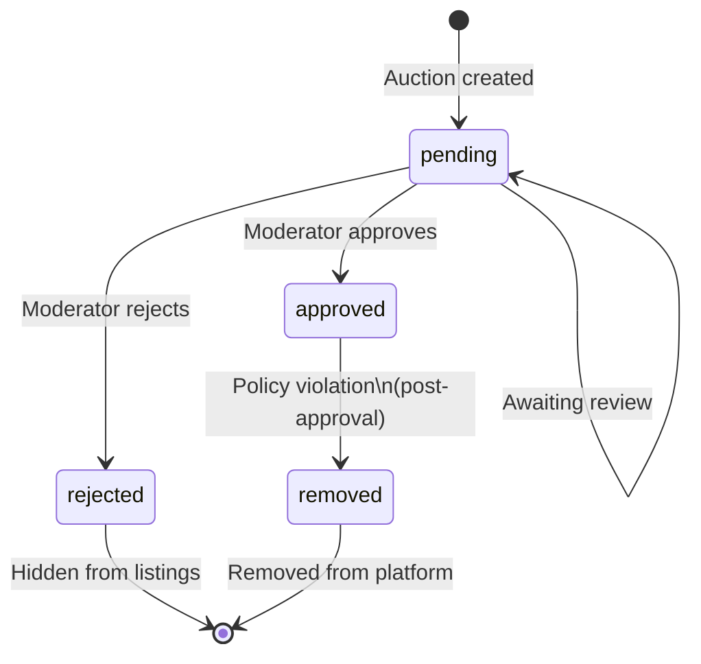
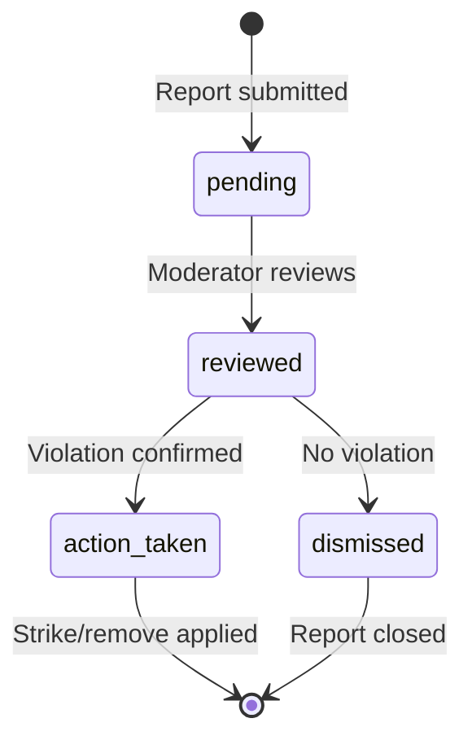

# State Machine Diagrams

This document describes the state machines for key entities in the Auction House system.

## 1. Auction Lifecycle

An auction progresses through several states from creation to completion.



### Auction States

| State | Description |
|-------|-------------|
| `upcoming` | Auction created but not yet started. Can be edited or deleted. |
| `current` | Auction is live and accepting bids. Anti-snipe extends end time. |
| `settling` | Auction ended with bids. Awaiting winner payment (cascading 24h windows). |
| `past` | Auction ended with no bids. No further action needed. |
| `completed` | Payment received, winner confirmed. Auction successfully concluded. |
| `failed` | All top 3 bidders failed to pay within their windows. |

### Transitions

| From | To | Trigger |
|------|-----|---------|
| `upcoming` | `current` | `start_time <= NOW()` (cron job) |
| `current` | `settling` | `end_time <= NOW()` AND has bids |
| `current` | `past` | `end_time <= NOW()` AND no bids |
| `settling` | `completed` | `confirm_payment()` called by winner |
| `settling` | `failed` | All top 3 exhausted OR 72h deadline |

---

## 2. Bid Collateral Lifecycle

Top 3 bidders lock 10% collateral which follows this lifecycle.



### Collateral States

| State | Description |
|-------|-------------|
| `none` | No collateral locked. Bid is outside top 3. |
| `locked` | 10% collateral locked. Bid is in top 3. |
| `returned` | Collateral returned to bidder. Either outbid from top 3 or auction completed by another winner. |
| `applied` | Collateral applied toward purchase. Winner's deposit becomes part of payment. |
| `forfeited` | Collateral forfeited. Winner failed to pay within 24h window. |

### Transitions

| From | To | Trigger |
|------|-----|---------|
| `none` | `locked` | Bid enters top 3 (new high bid or existing bidders drop) |
| `locked` | `returned` | Bid pushed out of top 3 by higher bid |
| `locked` | `returned` | Auction completes, this bid was #2 or #3 |
| `locked` | `applied` | This bidder confirms payment as winner |
| `locked` | `forfeited` | This bidder's 24h payment window expired |

---

## 3. Settlement / Payment Lifecycle

When an auction enters `settling`, the cascade payment system activates.



### Payment States (per bid)

| State | Description |
|-------|-------------|
| `pending` | Awaiting payment. Has a 24h deadline if current winner. |
| `paid` | Payment confirmed via blockchain transaction verification. |
| `failed` | Payment window expired. Collateral forfeited. |

### Settlement Flow

1. **Auction ends** → Status becomes `settling`
2. **Winner #1 notified** → 24 hours to pay
3. **If timeout** → Collateral forfeited, cascade to Winner #2
4. **Winner #2 notified** → 24 hours to pay (at their bid amount)
5. **If timeout** → Collateral forfeited, cascade to Winner #3
6. **Winner #3 timeout** → Auction marked `failed`

### Time Constraints

| Constraint | Duration |
|------------|----------|
| Per-winner payment window | 24 hours |
| Total settlement deadline | 72 hours |
| If 72h reached | All remaining locked collateral forfeited, auction fails |

---

## 4. User Moderation Lifecycle

Users can be restricted based on content violations.



### User States

| State | Field | Description |
|-------|-------|-------------|
| Active | `is_restricted = false`, `strikes < 3` | Normal user |
| Warned | `is_restricted = false`, `strikes > 0` | User has strikes but not restricted |
| Restricted | `is_restricted = true` | Cannot create auctions or place bids |

---

## 5. Content Moderation Lifecycle

Auctions go through content moderation.



### Moderation States

| State | Description |
|-------|-------------|
| `pending` | Awaiting moderator review. Visible but flagged. |
| `approved` | Passed moderation. Fully visible and functional. |
| `rejected` | Failed moderation. Hidden from public listings. |
| `removed` | Removed after approval due to policy violation. |

---

## 6. Report Lifecycle

User reports on auctions follow this flow.



### Report States

| State | Description |
|-------|-------------|
| `pending` | New report awaiting review |
| `reviewed` | Under active review |
| `action_taken` | Violation confirmed, action applied |
| `dismissed` | Report reviewed, no action needed |

---

## Database Enums Reference

### auction_status
```sql
CREATE TYPE auction_status AS ENUM (
    'upcoming',
    'current',
    'settling',
    'past',
    'completed',
    'failed'
);
```

### moderation_status
```sql
CREATE TYPE moderation_status AS ENUM (
    'pending',
    'approved',
    'rejected',
    'removed'
);
```

### Collateral Status (text column)
```
'none' | 'locked' | 'returned' | 'forfeited' | 'applied'
```

### Payment Status (text column)
```
'pending' | 'paid' | 'failed'
```

---

## Key Functions

| Function | Purpose |
|----------|---------|
| `update_auction_statuses()` | Cron job to transition auctions based on time |
| `place_bid()` | Place bid, manage top 3, lock/return collateral |
| `start_settlement()` | Initialize settlement when auction enters `settling` |
| `process_winner_timeout()` | Handle expired payment windows, cascade to next winner |
| `confirm_payment()` | Verify payment, complete auction, return other collateral |
